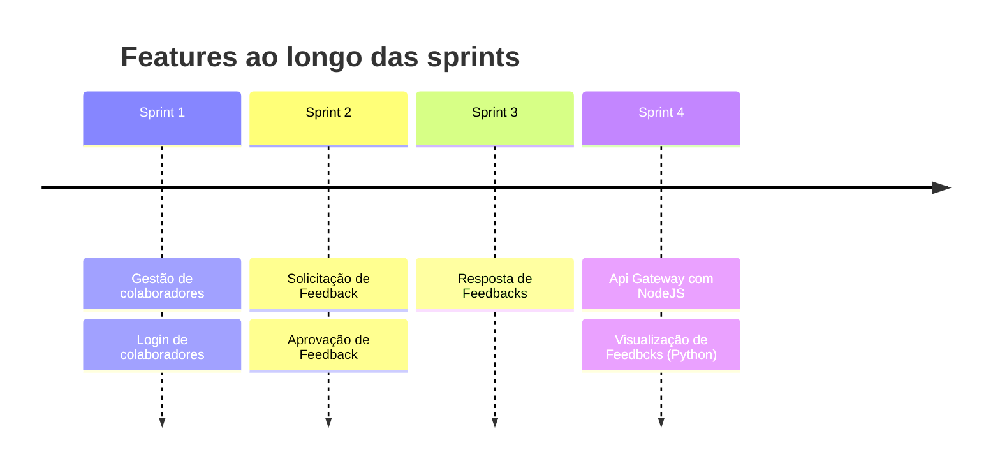
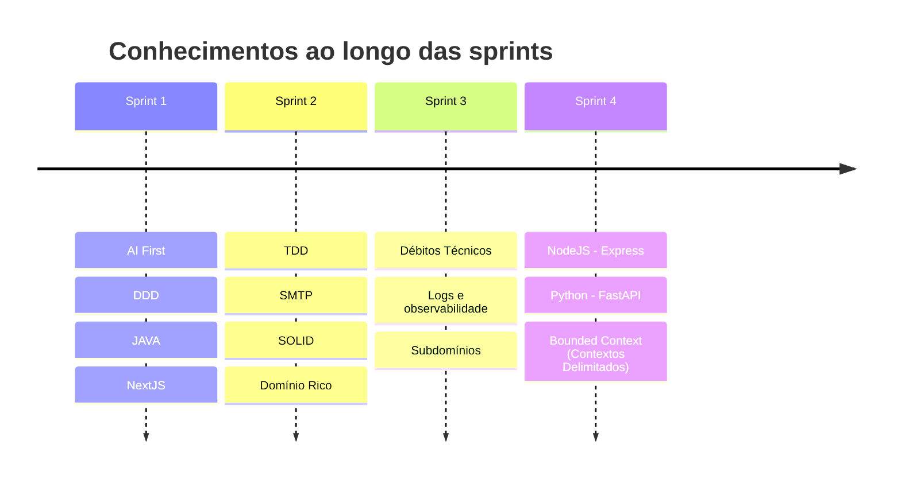

# Estrutura do Bootcamp

Vamos trabalhar o desenvolvimento de um sistema que de fato faz parte do backlog de negócios da CI&T. Trata-se de um sistema de gestão de feedback de clientes externos aos colaboradores internos da CI&T

## Tempo planejado para o projeto

O projeto foi planejado para durar 4 sprints, aonde que em cada sprint será trabalhado um único módulo e um único objetivo de negócio. Os seguintes módulos serão trabalhados

* Gestão de colaboradores e PDMs
* Login de colaboradores e PDMs
* Solicitação e aprovação de Feedback
* Reposta de Feedbacks
* Visualização de Feedbacks

## Conhecimentos a serem trabalhados ao longo do bootcamp

* AI First
* TDD
* DDD
* Bounded Context
* SOLID
* SMTP
* JAVA
* NextJS
* Débitos Técnicos
* Logs e observabilidade
* NODEJS - Express
* PYTHON

