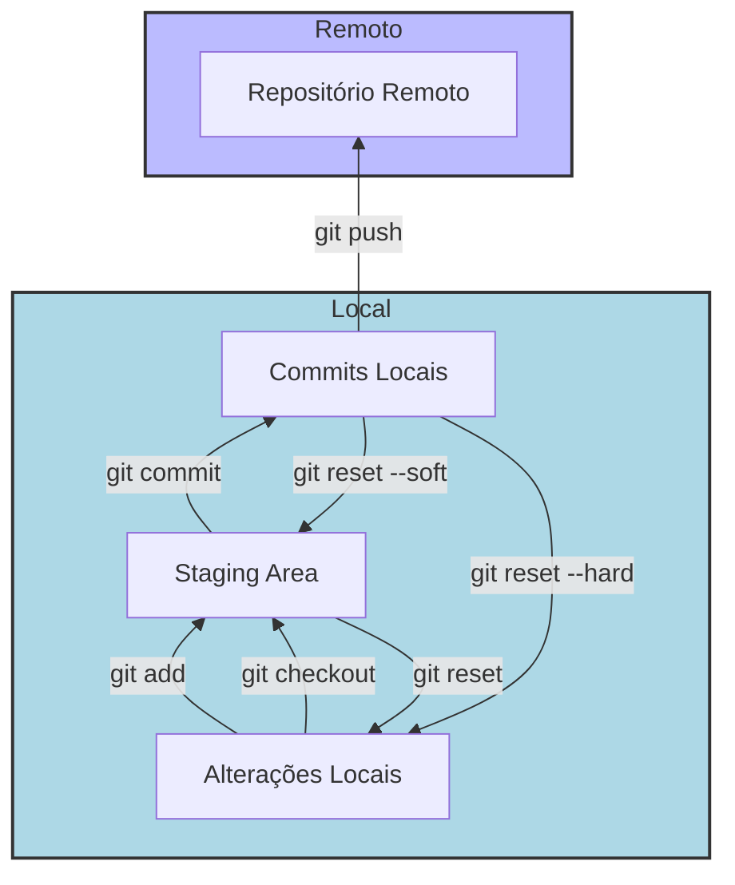

# Comandos Básicos do Git



## 1. Git Clone

### O que é?
O comando `git clone` é utilizado para criar uma cópia local de um repositório remoto.

### Sintaxe
```bash
git clone [URL do repositório]
```

### Exemplo
```bash
git clone https://github.com/usuario/repo.git
```

### Resultado
- Cria uma pasta com o nome do repositório e baixa todos os arquivos e o histórico de commits.

---

## 2. Git Checkout

### O que é?
O comando `git checkout` é usado para mudar de branch ou restaurar arquivos.

### Sintaxe
```bash
git checkout [nome da branch]
```

### Criando uma nova branch
Para criar e mudar para uma nova branch ao mesmo tempo, use:
```bash
git checkout -b [nome da nova branch]
```

### Exemplo
```bash
git checkout -b nova-feature
```

---

## 3. Git Pull

### O que é?
O comando `git pull` é utilizado para atualizar seu repositório local com as alterações do repositório remoto.

### Sintaxe
```bash
git pull
```

### Exemplo
```bash
git pull origin main
```

### Resultado
- Baixa e mescla as alterações do repositório remoto na branch atual.

---

## 4. Git Add

### O que é?
O comando `git add` é usado para adicionar alterações ao índice (staging area) antes de um commit.

### Sintaxe
- Para adicionar todos os arquivos:
```bash
git add .
```
- Para adicionar arquivos específicos:
```bash
git add [nome do arquivo]
```

### Exemplo
```bash
git add arquivo1.txt
```

---

## 5. Git Commit

### O que é?
O comando `git commit` é utilizado para salvar as alterações no repositório local.

### Sintaxe
```bash
git commit
```

### Variações
- Para adicionar todas as alterações e fazer o commit:
```bash
git commit -a
```
- Para fazer um commit com uma mensagem:
```bash
git commit -m "Mensagem do commit"
```

### Exemplo
```bash
git commit -m "Adiciona nova funcionalidade"
```

---

## 6. Usando o Vim para Commit

### O que é?
Se você usar apenas `git commit`, o editor Vim será aberto para editar a mensagem de commit.

### Como usar o Vim
1. **Entrar em modo de edição:** 
   - Pressione `i` para entrar em modo de inserção.
2. **Salvar e sair:**
   - Pressione `Esc`, digite `:x` e pressione `Enter`.

### Dica
- Usar `-m` evita a abertura do Vim e permite que você digite a mensagem diretamente.

---

## 7. Git Merge

### O que é?
O comando `git merge` é usado para combinar alterações de diferentes branches.

### Sintaxe
```bash
git merge [nome da branch]
```

### Exemplo
1. Mude para a branch onde deseja mesclar as alterações:
```bash
git checkout main
```
2. Execute o merge:
```bash
git merge nova-feature
```

### Resultado
- As alterações da branch especificada serão mescladas na branch atual.

---

## 8. Git Reset

### O que é?
O comando `git reset` é utilizado para desfazer alterações na staging area e, opcionalmente, nos commits.

### Variações
- **`git reset`**: Remove as alterações da staging area, mas mantém as mudanças na sua cópia local.
  
  **Uso:**
  ```bash
  git reset
  ```

- **`git reset --soft [commit]`**: Move o HEAD para o commit especificado e mantém as alterações na staging area, permitindo que você faça um novo commit.
  
  **Uso:**
  ```bash
  git reset --soft HEAD~1
  ```

- **`git reset --hard [commit]`**: Move o HEAD e descarta todas as alterações na staging area e na working directory, removendo permanentemente as alterações não confirmadas.
  
  **Uso:**
  ```bash
  git reset --hard HEAD~1
  ```

---

## 9. O que é o HEAD no Git?

O **HEAD** é um ponteiro especial no Git que aponta para o commit mais recente na branch atual em que você está trabalhando. Em outras palavras, ele representa o estado mais recente do seu repositório local na branch ativa.

### Funções do HEAD

1. **Identificação da Branch Ativa**: O HEAD indica qual branch você está atualmente utilizando. Quando você faz um checkout em uma nova branch, o HEAD é atualizado para apontar para o último commit dessa nova branch.

2. **Registro do Último Commit**: O HEAD aponta para o último commit na branch ativa, permitindo que você faça operações como `git commit`, `git merge` e `git reset` baseadas no estado atual.

3. **Referência para Navegação**: O HEAD também pode ser usado para navegar entre commits. Por exemplo, você pode referenciar o commit anterior usando `HEAD~1`, ou o commit mais recente em uma branch diferente.

### Importância do HEAD

O HEAD é fundamental para o funcionamento do Git, pois ele ajuda a manter o controle do fluxo de trabalho e das alterações no repositório. Entender como o HEAD opera é essencial para manipular branches e commits de forma eficaz.

## 10. Resumo dos Comandos

| Comando                  | Descrição                                           |
|-------------------------|----------------------------------------------------|
| `git clone`             | Clona repositório remoto para local                |
| `git checkout`          | Muda de branch ou restaura arquivos                |
| `git pull`              | Atualiza branch local com alterações remotas       |
| `git add .`             | Adiciona todas as alterações ao staging            |
| `git commit -m "msg"`   | Salva alterações com mensagem de commit            |
| `git merge`             | Mescla alterações de outra branch                  |
| `git reset`             | Remove alterações da staging area                  |
| `git reset --soft`      | Move HEAD e mantém alterações na staging area      |
| `git reset --hard`      | Move HEAD e descarta todas as alterações           |

---

## Dicas Finais
- Sempre faça `git pull` antes de começar a trabalhar em novas funcionalidades.
- Use mensagens de commit claras e descritivas para manter um histórico organizado.
- Pratique os comandos frequentemente para se familiarizar com o fluxo de trabalho do Git.

## Git no VS Code (Visual Studio Code)

O VS Code possui uma ferramenta nativa para se trabalhar com Git. Apesar de ser importante entender os fundamentos e como ele funciona pela linha de comando, a forma gráfica do VS Code e de outras IDEs pode aumentar a sua produtividade. 

### Tutorial
[Como usar a integração do Git no Visual Studio Code](https://www.digitalocean.com/community/tutorials/how-to-use-git-integration-in-visual-studio-code-pt)