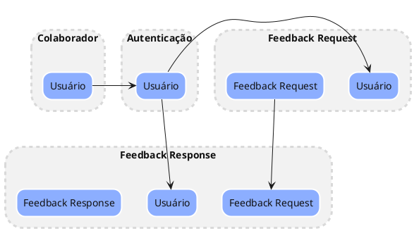
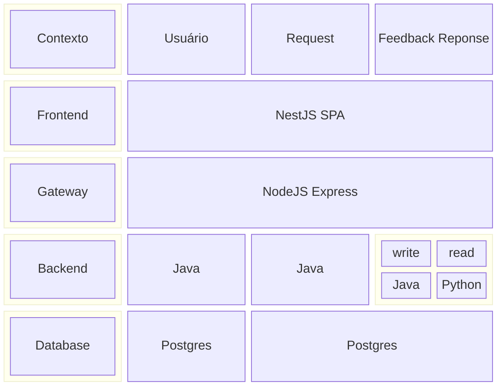

# Desenho arquitetural (Padrões Estratégicos)

Nesse projeto iremos usar diversos conceitos do DDD para desenhar a solução, vale lembrar que não iremos usar todos os conceitos, apenas aqueles necessários para o desenvolvimento que temos nesse desafio

## Context Map (Mapa de Contextos)

O context map é uma ferramenta do DDD para identificar os contextos de um domínio e a relação entre eles, vamos usar esse conceito de forma bem simplificada para identificar nossos microserviços e a relação entre eles.

Nosso sistema é um sistema aonde um colaborador de uma consultoria faz uma requisição de feedback para um avaliador externo a consultoria, ou seja, o cliente da consultoria. Nesse caso identificamos que temos tanto a solicitação de feedback voltada a um avaliador, quanto a resposta de feedback voltada a uma solicitação. Dessa forma já podemos identificar 4 contextos: 
    
- **Gestão de Usuários**
- **Autenticação**
- **Solicitação de Feedback**
- **Resposta de Feedback**



## Arquitetura Contextual

Vamos observar como fica a arquitetura de cada contexto em suas camadas



## Arquitetura em microserviços

Abaixo observamos em mais detalhes a decomposição final em microserviços

```plantuml
@startuml

!include <C4/C4_Component>

!define FONTAWESOME https://raw.githubusercontent.com/tupadr3/plantuml-icon-font-sprites/master/font-awesome-5
!define DEVICONS https://raw.githubusercontent.com/tupadr3/plantuml-icon-font-sprites/master/devicons
!include DEVICONS/java.puml
!include DEVICONS/nginx.puml
!include DEVICONS/nodejs.puml
!include DEVICONS/python.puml
!include DEVICONS/react.puml
!include DEVICONS/postgresql.puml

Container(frontend, "Frontend de Feedbacks Externos", "React - Vite", "Telas de gestao de solicitação, aprovação e resposta de feedback de clientes externos aos consultores internos", $sprite="react")
Container(gateway, "Api Gateway", "NodeJS", "Proxy reverso node express com validação dos tokens JWT", $sprite="nodejs")

Boundary(backend, "Sistema de Feedbacks Externos", "Microservices") {
    Container(FeedbackRequestService, "Serviço de Solicitação de Feedback", "Java - Spring Boot", "Gerencia a criação de perguntas, aprovação de perguntas pelo PDM e geração do link para os avaliadores externos", $sprite="java")
    Container(FeedbackResponseService, "Serviço de Reposta de Feedback", "Java - Spring Boot", "Permite aos clientes externos responderem as perguntas do feedback solicitado. Valida o tempo de validade da solicitação", $sprite="java")
    Container(FeedbackViewerService, "Serviço de Visualização de Feedback", "Python - FastApi", "Permite a visualização de feedbacks recebidos. Exibe de forma anonima para o usuario e não anonima para o PDM", $sprite="python")
    Container(UserService, "Serviço de Usuários", "Java - Spring Boot", "Gestão e Login de usuários com token JWT", $sprite="java")
    ContainerDb(userDb, "Banco de Usuários", "Postgres", "Armazena dados de usuários", $sprite="postgresql")
    ContainerDb(feedbackDb, "Banco de Dados de Feedbacks", "Postgres", "Armazena dados de feedback e perguntas.", $sprite="postgresql")
}

Rel_D(FeedbackRequestService, feedbackDb, "uses")
Rel_D(FeedbackResponseService, feedbackDb, "uses")
Rel_D(FeedbackViewerService, feedbackDb, "uses")
Rel_D(UserService, userDb, "uses")

Rel_D(frontend, gateway, "Valida token JWT e encaminha request para MS correspondente")
Rel_D(gateway, FeedbackRequestService, "Exibir Solicitação\nSolicitações\nSolicitações a aprovar\nPDM Aprovar Solicitação\nPDM Rejeitar Solicitação\nEditar Solicitação")
Rel_D(gateway, FeedbackResponseService, "Responder Solicitação")
Rel_D(gateway, FeedbackViewerService, "Listar Respostas\nExibir Resposta User\nExibir Resposta PDM")
Rel_D(gateway, UserService, "Cadastrar Usuario\nEditar Usuário\nLinkar PDM ao usuário\nLogin")

@enduml
```
