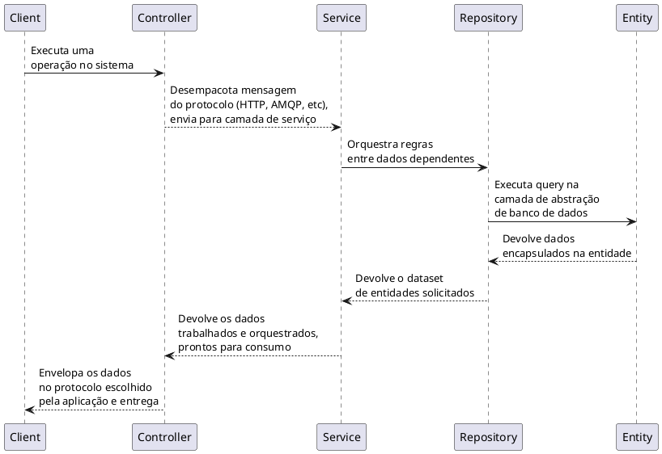

# Building Blocks (Padrões Táticos)

1. **Entidades**: As entidades são objetos que possuem uma identidade própria e são fundamentais para a modelagem do domínio. Cada entidade é identificada de maneira única, o que permite que seu estado possa ser rastreado ao longo do tempo. Por exemplo, em um sistema de biblioteca, um livro pode ser considerado uma entidade, pois possui atributos como título, autor, ISBN e status de disponibilidade. Da mesma forma, um leitor também é uma entidade, com atributos como nome, número de identificação e histórico de empréstimos. Essa identidade é crucial, pois garante que as operações e interações com essas entidades sejam precisas e consistentes, permitindo ao sistema refletir com fidelidade a realidade do domínio que está sendo modelado.

1. **Repositórios**: Os repositórios desempenham um papel central na persistência de dados, sendo responsáveis por recuperar e armazenar entidades e agregados. Eles atuam como uma ponte entre a lógica de negócios da aplicação e a camada de persistência de dados, como um banco de dados. A principal função de um repositório é fornecer uma interface para a manipulação de entidades, permitindo operações como adicionar, buscar, atualizar e remover objetos. Por exemplo, em um sistema de biblioteca, um `BookRepository` pode oferecer métodos para encontrar livros por título, autor ou ISBN. Essa abstração simplifica a implementação, permitindo que os desenvolvedores se concentrem na lógica de negócios sem se preocupar com os detalhes de como os dados são armazenados e recuperados.

1. **Serviços**: Os serviços encapsulam a lógica de negócios que não se encaixa de forma clara em entidades ou Value Objects. Eles são responsáveis por realizar operações que podem envolver múltiplas entidades ou que requerem regras de negócio complexas. Por exemplo, em um sistema de e-commerce, um serviço pode calcular o valor total de um pedido, considerando os preços dos itens, descontos, impostos e taxas de envio. Essa lógica pode ser muito mais complexa do que simplesmente somar valores, pois pode incluir regras específicas de aplicação de descontos dependendo do tipo de cliente ou do valor total do pedido. Ao manter essa lógica em um serviço separado, o código se torna mais modular e fácil de manter, permitindo que os desenvolvedores isolem e testem essa lógica de maneira eficiente sem interferir nas entidades ou na persistência de dados.

1. **Controllers (MVC)**: No contexto do desenvolvimento de software, especialmente em aplicações web, um **Controller** é um componente que atua como intermediário entre a interface do usuário (UI) e a lógica de negócio da aplicação. Ele é responsável por gerenciar as requisições do usuário, processar essas requisições, interagir com os serviços e retornar as respostas apropriadas.

