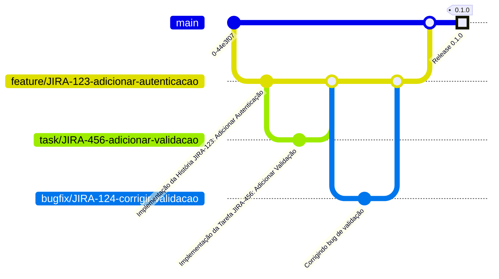

# Modelo de branchs do Git

Este documento explica como as branches no fluxo de trabalho Git estão relacionadas às histórias e tarefas no Jira. Cada branch será nomeada de acordo com o ID da história ou tarefa correspondente, facilitando a rastreabilidade e a organização do desenvolvimento.

## 2. Estrutura de Nomenclatura das Branches

### 2.1 Nomenclatura das Branches
- **Histórias de Usuário**: As branches que representam histórias de usuário devem ser nomeadas como `feature/id_jira-nome`, onde `id_jira` é o identificador da história no Jira e `nome` é uma descrição breve da funcionalidade.
- **Tarefas**: As branches relacionadas a tarefas devem ser nomeadas como `task/id_jira-nome`, onde `id_jira` é o identificador da tarefa no Jira e `nome` é uma descrição breve da tarefa.
- **Correção de Bugs**: As branches que envolvem correções de bugs devem ser nomeadas como `bugfix/id_jira-nome`, onde `id_jira` é o identificador do bug no Jira e `nome` é uma descrição breve da correção.

### 2.2 Exemplo de Nomenclatura
- História de Usuário: `feature/JIRA-123-adicionar-autenticação` (representando uma história no Jira com ID `JIRA-123`)
- Tarefa: `task/JIRA-456-adicionar-validação` (representando uma tarefa no Jira com ID `JIRA-456`)
- Correção de Bug: `bugfix/JIRA-789-corrigir-erro-login` (representando um bug no Jira com ID `JIRA-789`)

## 3. Fluxo de Trabalho com Integração ao Jira

1. **Criar a Ramificação de Funcionalidade**:
   - Inicie a partir da branch `main` e crie uma nova branch para a funcionalidade relacionada à história:
     ```bash
     git checkout main
     git checkout -b feature/JIRA-123-adicionar-autenticação
     ```

2. **Criar a Ramificação de Tarefa**:
   - Dentro da branch `feature/JIRA-123-adicionar-autenticação`, crie uma nova branch para uma tarefa específica:
     ```bash
     git checkout -b task/JIRA-456-adicionar-validação
     ```

3. **Desenvolver e Comitar**:
   - Realize as mudanças necessárias na branch `task/JIRA-456-adicionar-validação` e faça os commits:
     ```bash
     git add .
     git commit -m "Implementa a tarefa JIRA-456: adicionar validação"
     ```

4. **Criar um Pull Request**:
   - Após concluir a tarefa, faça push da branch `task/JIRA-456-adicionar-validação` para o repositório remoto:
     ```bash
     git push origin task/JIRA-456-adicionar-validação
     ```
   - Acesse o Bitbucket e crie um pull request para mesclar a branch `task/JIRA-456-adicionar-validação` na branch `feature/JIRA-123-adicionar-autenticação`.

5. **Mesclar a Tarefa de Volta para a Funcionalidade**:
   - Após a revisão e aprovação do pull request, a branch `task/JIRA-456-adicionar-validação` será mesclada na branch `feature/JIRA-123-adicionar-autenticação`.

6. **Finalizar a Funcionalidade**:
   - Quando a funcionalidade estiver completa e testada, crie um pull request para mesclar a branch `feature/JIRA-123-adicionar-autenticação` de volta para a branch `main`.

7. **Remover Branches**:
   - Após a mesclagem, você pode excluir as branches de tarefa e funcionalidade:
     ```bash
     git branch -d task/JIRA-456-adicionar-validação
     git branch -d feature/JIRA-123-adicionar-autenticação
     ```

## 4. Diagrama do Fluxo de Trabalho com gitGraph

Abaixo está um diagrama representando a relação entre as branches e as histórias/tarefas no Jira:

