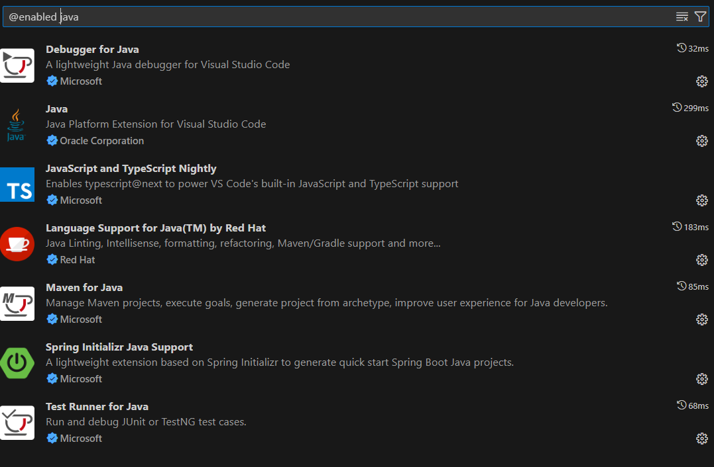
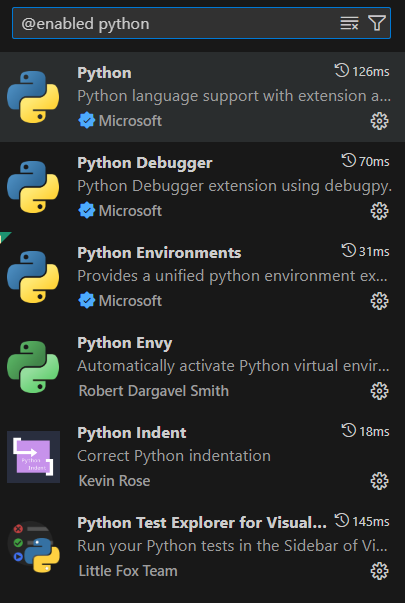
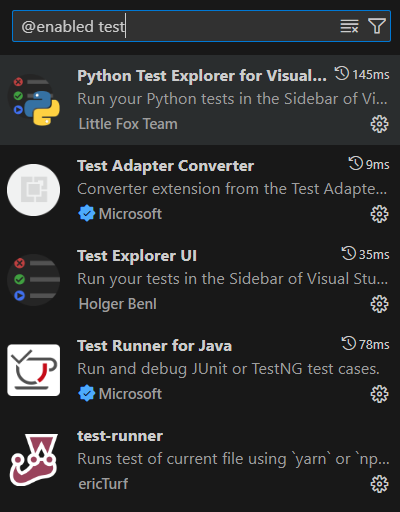

# VSCode

Após instalar o VSCode, uma sequencia de plugins é recomendada para desenvolvimento nas tecnologias desse projeto

## Bons plugins para desenvolvimento java e javacript

## Bons plugins para desenvolvimento python

## Bons Plugins para testes

## Demais tecnologias

### Git

### Docker
